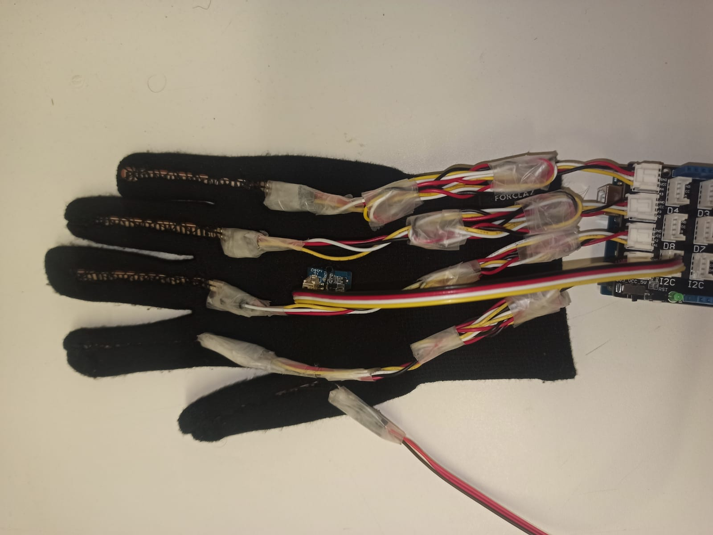
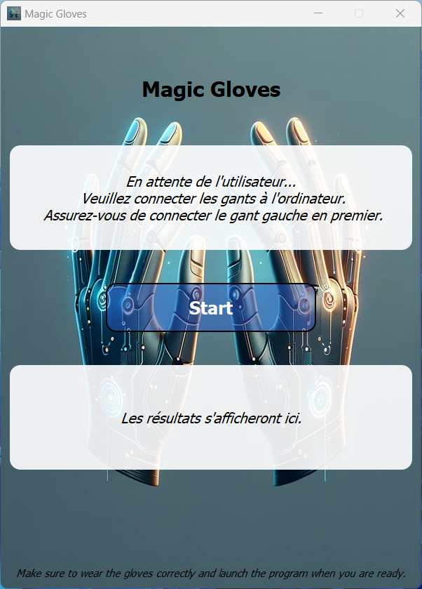

# Magic Gloves
## Description
"Magic Gloves" is an innovative project aimed at translating sign language into spoken language using smart gloves equipped with sensors. This technology captures the intricate movements and positions of sign language and translates them into words, bridging communication gaps for the deaf and hard-of-hearing community. Our GitHub repository documents the development journey, including data collection, machine learning models, and hardware-software integration, showcasing our commitment to enhancing accessibility through AI and IoT.
You can find more details (In french) about the project in the [wiki](https://github.com/MouadFiali/magic-gloves/wiki) section of this repository.

## Table of Contents
- [Requirements](#requirements)
- [Usage](#data-collection)
- [Machine Learning Models](#machine-learning-models)
- [Arduino Code](#arduino-code)
- [Data Collection](#data-collection)
- [Notes](#notes)

## Requirements
In order to run the project application [`magic_gloves.py`](magic_gloves.py), you will need some hardware and software requirements. 

- The hardware requirements are as follows:
  - 2x Arduino Uno (One for each hand)
  - 10x Flex sensors (5 for each hand)
  - 2x Grove 6-axis Accelerometer & Gyroscope (One for each hand)
  - A pair of gloves to attach the sensors to

<center></center>

- The software requirements are as follows:
  - All the python libraries listed in the [`app/requirements.txt`](app/requirements.txt) file. You can install them using the following command in your environment:
  ```bash
  pip install -r requirements.txt
  ```
However, if you are only interested in testing the model(s), notebooks and the dataset, you can only install the [`models/requirements.txt`](models/requirements.txt) file using the same command as above.


## Usage

In order to use the project, you will need to first run the [`rnn.py`](models/rnn.py) script to train the model and save it using the following command:
```bash
python models/rnn.py
```
Make sure the you specify the correct path to the dataset in the script before running it in the following line:
```python
# Load the dataset
df = pd.read_csv('importfichier.csv', header=None)
```

After training the model, make sure to put the resulting model files in the root directory of the project. Then, you can run the [`magic_gloves.py`](magic_gloves.py) script to start the application using the following command:
```bash
python magic_gloves.py
```
Which will open a window that looks like this, and all you have to do is follow the instructions:


## Machine Learning Models

The main machine learning model used in this project is a recurrent neural network (RNN) which is trained on the dataset collected using the arduino boards. The model is trained using the [`rnn.py`](models/rnn.py) script and the resulting model files are saved in the root directory of the project.

However, 2 other models were tested and trained on the dataset, namely a Long Short-Term Memory (LSTM) model and a Gate Recurrent Unit (GRU) model. The scripts used to train these models are [`lstm.py`](models/lstm.py) and [`gru.py`](models/gru.py) respectively. The resulting model files are also saved in the root directory of the project.

The file [`test_predictions.py`](test/test_predictions.py) is used to test the models on real-time data collected from the arduino boards. The script reads the data from the arduino boards and uses the models to predict the sign.

## Arduino Code

The arduino code [`sensor_reader.ino`](sensor_reader/sensor_reader.ino) is used to read the data from the sensors and send it to the python scripts using the serial communication protocol. The code is uploaded to the arduino boards using the Arduino IDE.

## Data Collection

The data collection process is done using the [`data_collector.py`](data_collection/data_collector.py) script. The script reads the data from the arduino boards and saves it in a csv file. The script is run using the following command:
```bash
python data_collection/data_collector.py
```

## Notes
- The dataset posted on Kaggle is a small dataset used as a proof of concept. However in real case scenarios, the dataset should be much larger and should contain more signs and more data points for each sign.

- In order to run the python scripts ([`data_collector.py`](data_collection/data_collector.py), [`test_predictions.py`](test/test_predictions.py)), you will need to change the ports names (numbers) in the scripts to match the port which the arduino is connected to. This can be done by changing the following lines in the scripts:
```python
# LEFT 
ser = serial.Serial('COM7', 9600)
# RIGHT
ser2 = serial.Serial('COM4', 9600)
```